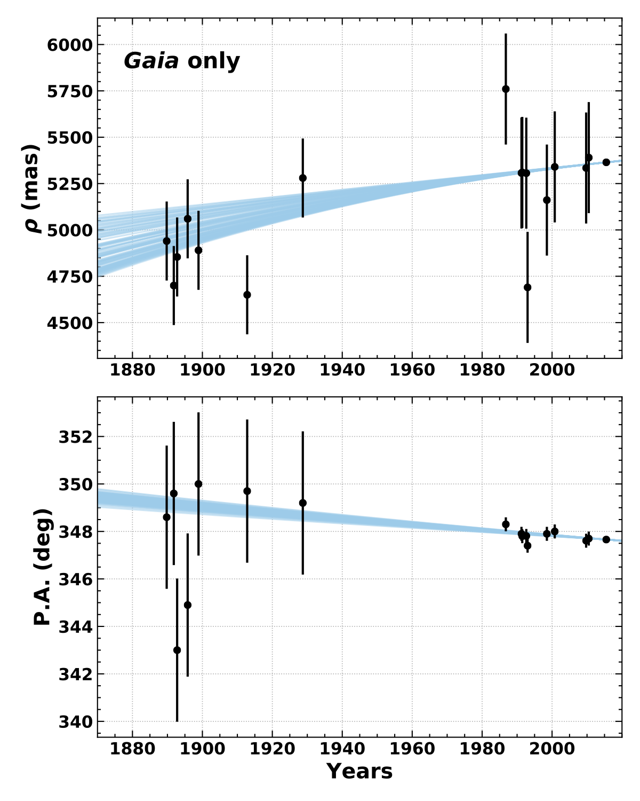
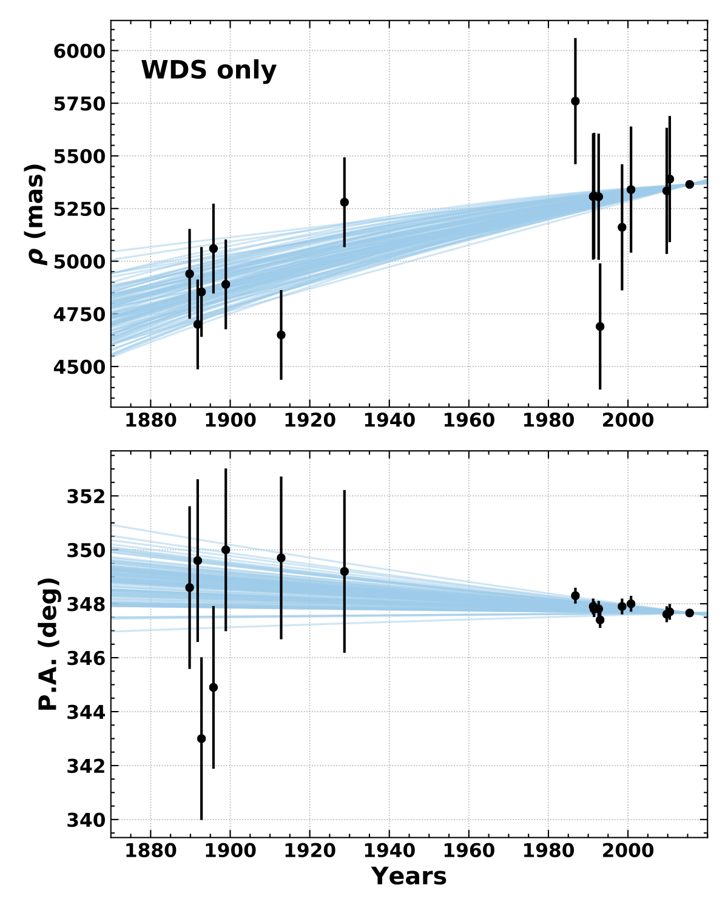
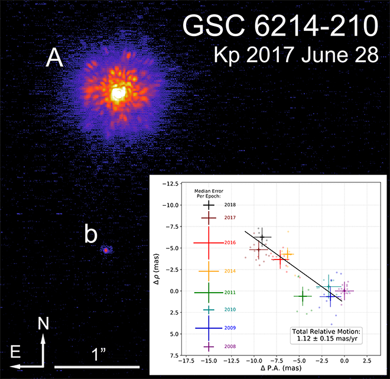
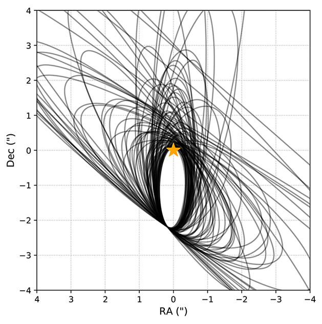
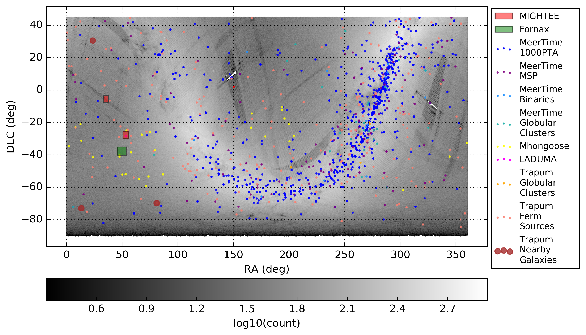
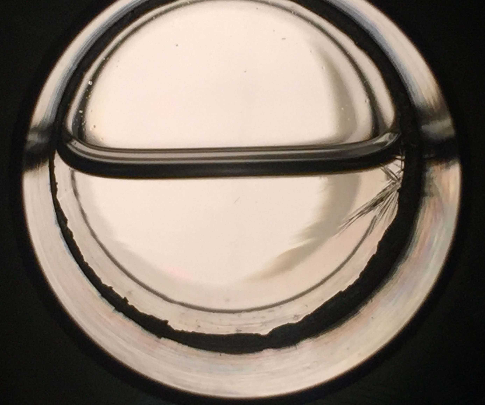
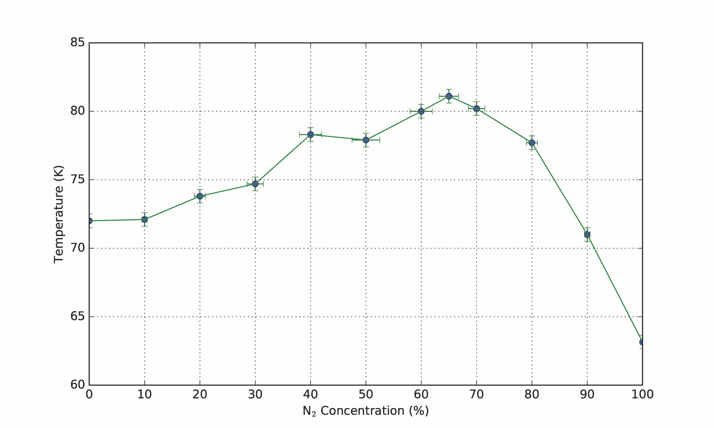

## Binary Differential Imaging
### Advisor: Jared Males
### Univ of Arizona, 2019 -

A difficulty in direct imaging searches for faint planet or brown dwarf companions close to their host stars is to sufficiently subtract the point spread function of the host star from the image without also removing flux from the faint companion.  Reference differential imaging (RDI) uses images of similar stars to build up a model reference PSF, which does not include a faint companion, which is then subtracted from the science target to reveal the flux from the companion.  [Binary Differential Imaging (BDI)](https://arxiv.org/abs/1509.00007)  is a similar technique which uses binary stars to build up the model PSF.

In BDI, two stars are imaged simultaneously in the same wavelength and same isoplanatic patch at high Strehl ratios.  The reference PSF for one star is then built up using principle component analysis (PCA) from images of the other, and vice versa.  I am working on performing BDI on datasets of 22 binary systems imaged with Mag-AO/CLIO in L-band.  [Rodigas et al. 2015](https://arxiv.org/pdf/1509.00007.pdf) showed that BDI has the potential to perform better at close separations than ADI

***

## Orbit Fitting of Wide Stellar Binaries with Gaia
### Advisor: Adam Kraus
### Univ of Texas at Austin, 2019 -

[Paper](https://arxiv.org/pdf/2003.11106.pdf)

The monitoring of orbits is one of the oldest tools used to measure the properties and evolution of astrophysical systems.  (Mis)alignment of angular momentum vectors between stellar rotation, binary orbits, circumstellar disks, and plantary system orbits all encode information about the dynamical history of the system.  Wide stellar binaries can have exceedingly long orbital periods requiring years or decades of astrometric monitoring to constrain orbital motion.  Gaia, with its exceptionally precise astrometry and proper motion, offers the promise of studying wide stellar binary orbits with no observational overhead.  The question remains as to whether Gaia astrometry is precise enough to provide meaningful constraints on orbital parameters that allow scientific study of binary orbit alignment with other components of the system.

I adapted the Orbits for the Impatient (OFTI; Blunt et al. 2017) to fit Gaia relative separation and proper motion for a selection of wide binaries for which both components are well resolved.  I examined the orbital element constraints produced by fitting with Gaia only, and compared it to orbital element constraints from long time baseline astrometric monitoring from the Washington Double Star Catalog.  For example, this plot shows orbit fit results for DS Tuc B relative to DS Tuc A using Gaia astrometry (left) and WDS astrometry spanning a 100 year observational period (right).  (The WDS astrometry points are overplotted in the Gaia plot for comparison, they were not used in the Gaia fit).  The Gaia orbit fit results are significantly better constrained than WDS, and did not require 100 years of orbit monitoring to obtain.  The Gaia fit results were used in the [Newton et al. 2019](https://arxiv.org/pdf/1906.10703.pdf) paper reporting the discovery of a transiting planet around DS Tuc A, to show that the binary orbit axis is nearly aligned with the stellar spin and planet orbit axes.

| | |
|:---:|:---:|
|  |  |

I found that Gaia alone is sufficient for producing reliable orbital element posteriors under some conditions:
* Both objects have well-defined solutions in Gaia DR2 with [RUWE](https://gea.esac.esa.int/archive/documentation/GDR2/Gaia_archive/chap_datamodel/sec_dm_main_tables/ssec_dm_ruwe.html) ~ 1.0 and large parallax_over_error values (>~ 10)
* The orbital period is sufficiently long that no acceleration was observed during the Gaia measurement period
* The two objects are sufficiently separated that the PSFs do not interfere with one another
* Niether object is itself an unresolved binary

Future Gaia data releases will further improve orbital constraints by increasing the number of resolved binary systems with well-defined solutions, increasing the number for which both objects have radial velocity measurements, and introducing plane-of-sky acceleration terms.

I produced a small python widget to help enable users to make use of this technique: https://github.com/logan-pearce/lofti_gaiaDR2.  The paper is currently nearing submission.

***

## Orbital Motion of Wide Planetary-Mass Companions to Low-Mass Stars
### Advisor: Adam Kraus
### Univ of Texas at Austin, 2017-2019

[Published in AJ, Vol 157:71](https://iopscience.iop.org/article/10.3847/1538-3881/aafacb/meta)
[ArXiv entry](https://arxiv.org/abs/1812.08860)

Planetary mass companions are large mass planets (on the order of 15 Mjup)  on wide orbits (100's of AU) from their host stars.  They exist in a parameter such that it is unclear if they represent the high end of planetary masses, the low end of brown dwarf masses, or if there is even is a dividing line in the substellar mass function at all.  There are a handful of these wide orbit companions that have been discovered through direct imaging surveys of young low mass stars.  Their wide orbits and young ages make them ideal for testing planet and star formation models, because they are young enough and wide enough that they can be studied relatively easily through high contrast imaging.

My work has focused on an orbital analysis of one particular wide orbit planetary mass companion, GSC 6214-210 b.  It is a ~15 Mjup companion to a K5 dwarf star in the Upper Scorpious star-forming region.  GSC 6214-210 b has been observed with the NIRC2 camera on the Keck II telescope for 10 years, enough to measure the relative astrometry and test for orbital motion.  I developed my own PSF-fitting relative astrometry algorithm to observe orbital motion, then fit orbital parameters to my astrometry using a custom implementation of the Orbits for the Impatient (OFTI) algorithm (Blunt et. al. 2017).

| | |
|:---:|:---:|
|  NIRC2 image of GSC 6214-210, with its companion seen just to the south and east.  Inset: Relative motion of the companion found in this study.  Error bars to the left represent median error in individual image posteriors | 100 randomly selected orbits from the posterior of accepted orbital parameters from the OFTI algorithm.  |

We found that orbital element posteriors for GSC 6214-210 b, along with complementary lines of evidence,  make formation at close orbital radius, consistent with the core accretion model of planet formation, and subsequent dynamical scattering to its current wide radius is highly unlikely.  Star formation pathways such as gravitational instability are more likely to explain this object's current orbit.  Other orbital studies of other wide planetary-mass companions have made similar conclusions (see Bryan et. al. 2016).  This could indicate that dynamical scattering it not a dominant formation pathway for these objects.  This work can easily be repeated for other directly imaged wide companion systems.

 [Poster from AAS 233, 2019.](https://github.com/logan-pearce/logan-pearce.github.io/blob/master/img/poster_aas233.png)
 
 I have also been adapting the OFTI methodology to fit wide binary stars with well-defined astrometry and proper motions in Gaia.  The precision of Gaia astrometry allows us to fit one observational epoch using the stars' relative RA/Dec, proper motion in RA/Dec, and radial velocity (either from Gaia (rare) or independant measurements).  Additionally accelerations can be used to constrain orbits.  The equations are derived here: [Position Vector Equations](https://github.com/logan-pearce/LOFTI/blob/master/Using_Position_Vector/Solving_for_orbital_elements_given_position_vector_obs.pdf)

[GitHub repo for this project](https://github.com/logan-pearce)

I am also a part of the orbitize! project -- an open-source object-oriented python package for fitting orbital parameters to directly-imaged planet astrometry.  Orbitize! allows users to select from multiple parameter fitting methodologies, including OFTI, that are statistically robust, and outputs fits and plots of the results.  Orbitize! version 1 is expected in September 2018.

[Orbitize! Docs](https://orbitize.readthedocs.io/en/latest/)

***

## 1 Million Stars for Targeted SETI Observations with MeerKAT
### Advisor: Howard Isaacson
### Berkeley SETI Research Center, Univ of California, Berkeley, 2018

The Breakthrough Listen Project, at the Berkeley SETI Research Center in Berkeley, CA, will be conducting targeted SETI observations on the newly commissioned MeerKAT interferometric radio telescope in South Africa.  Observations will be commensal - BL will not have control of the telescope, and instead will piggyback off of the observations of the numerous large survey programs (LSPs) that have been approved to observe on MeerKAT.  BL intends to observe 1 million stars with MeerKAT - the largest coordinated SETI program in history.  My project, conducted at the BSRC summer internship in 2018, was to create the target list of 1 million stars for the MeerKAT program.

The Gaia Data Release 2 catalog was the starting point for our target list.  Gaia DR2 contains astrometric information for 1.7 billion objects within our galaxy.  After applying strict data quality filters, we narrowed the catalog to 27 million high-quality Gaia objects within MeerKAT's field of view from which to draw our target list.

| |
|:---:|
|  Anticipated pointings of the MeerKAT Large Survey Programs, plotted over a histogram of all the sources in Gaia DR2 with high quality solutions that fall within MeerKAT's field of view (grey) |

But because the observing will be commensal, the objects on our target list need to be ones we have a reasonable expectation of actually observing.  So, to the greatest extent possible, we determined as many of the specific pointings of each of the MeerKAT LSPs as we could.  All objects on the high-quality Gaia subset within each pointing were put on the target list.  We also included a volume complete sample of all objects in the high-quality subset out to 160 pc, to accommodate any unanticipated pointings.  We also added nearby stars which are too bright to be in the Gaia catalog and fall within MeerKAT's field of view.  This brought us to just under 1.2 million objects on our target list!

Lastly, I wrote a script which takes in a list of RA/Dec pointings, with optional selection criteria, and returns all of the target list objects you could observe, and any objects which might be interesting for SETI science such as confirmed exoplanet hosts or pulsar which fall within the beam.  This script will be an essential part of BL's observing operations with MeerKAT.

Poster from intern symposium, 2018.  [SETI Poster](https://github.com/logan-pearce/logan-pearce.github.io/blob/master/img/poster_v2.png)

[GitHub repo for this project](https://github.com/logan-pearce/breakthroughlisten)

*** 
## Methane-Ethane-Nitrogen Stability on Titan
### Advisor: Jennifer Hanley
### Astrophysical Ices Laboratory, Northern Arizona University, 2016

The Casini space probe detected both methane and ethane in the lakes of Titan, which is expected due to the presence of methane in Titan's atmosphere (of which ethane is a photochemical reaction product), and Titan's surface temperature range which permits those species to exist in liquid phase.  Titan's seasonal temperatures do fluctuate in the range that corresponds to the freezing points of both pure methane and pure ethane, so if the lakes were composed of only one of the two chemical species, the lakes would likely freeze on seasonal timescales.  The concentrations of the lakes remains unknown, but they are likely some mixture of the two species, along with nitrogen dissolved from the atmosphere, and other photochemical derivatives of methane.  The Astrophysical Ices Laboratory at Northern Arizona University has found that mixing methane and ethane together depresses the freezing point of the mixture well below that of the pure species', and below the seasonal temperatures of Titan.  So it is possible that the chemical mixture of the lakes of Titan would not allow them to freeze or form ice.  The behavior of the lakes is important for understanding how the lakes interact with the rest of the Titan environment, and for informing potential future missions to exploring Titan.

My project, conducted as part of an NSF REU, was to investigate the behavior of the chemical mixtures when nitrogen is added to the mix.  Nitrogen exists in large concentration and at high pressures in the atmosphere, so it is likely it would be dissolved in some amount in the lakes.  Due to the time limitation of the summer project, I focused on one portion of the ternary diagram, keeping the relative methane/ethane fraction constant and testing the freezing point at varying concentrations of nitrogen.

I found that adding nitrogen did affect the freezing point of the mixtures, but they remained below Titan's seasonal temperature range, suggesting that ice would not form in Titan lakes if they existed at these concentrations.  However, I only explored a small fraction of the ternary phase space for these mixtures, there are a lot of possible other concentrations of the lakes to explore, as well as the influence of other chemical species which could exist in the lakes.

| | |
|:---:|:---:|
|  A liquid sample just at the freezing point (liquidus).  Small crystals can be seen beginning to form in the right hand side of the sample chamber. | Plot of measured freezing points as a function of nitrogen concentration in the sample.  |

I discovered something else interesting in the course of my study.  The experiments in the 60-70% N2 range had boiling points very near to their freezing point, making it impossible to observe the freezing.  To ameliorate this, I elevated the pressure in the chamber to raise the boiling point far enough above the freezing point to allow them to be independently observed.  During those higher-pressure experiments I noticed something strange.  Image A shows a sample at the normal experimental pressure of 1 Bar.  We see little ripples in the liquid, indicating that there are two liquids here that are mingling but not mixing.  Image B shows a sample at the elevated sample pressure of ~2 Bar.  There are now two distinct liquid liquid layers of different densities.  The two liquids have separated, and there is a distinct meniscus between them.  What's more, the top layer condensed out first as the sample was cooled, and the liquid that formed the bottom layer would condense on the top meniscus and drip down through the top layer, growing the bottom layer as it cooled.  In Image B you can just see one of these drops forming on the bottom of the top meniscus.  We measured both layers to contain all three chemical species, but in different amounts (one was nitrogen-rich, the other ethane-rich).  This only occurred in the high pressure experiments.  The explanation for this behavior remains unclear and is being investigated at NAU.

| |
|:---:|
|  A: a sample at 1 bar pressure B: a sample at 2 bar pressure.  Two liquid layers are present with a vapor layer above, and the bottom layer liquid can be seen forming a drip on the meniscus of the top layer. |

